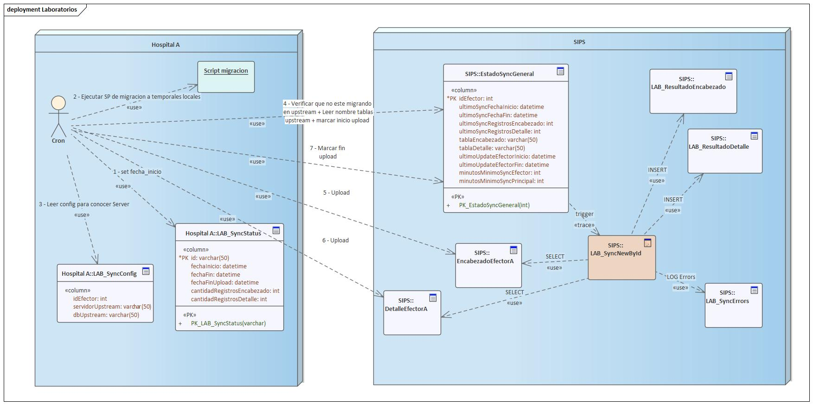

# Proceso de migración desde Hospital periferico

## Pasos en el hospital periferico

Los pasos se ejecutan en un proceso cron, cada X tiempo. El código se compone de 2 stored procedures (un stored para hacer la migración, código actual de migración, y un stored que puede ser llamado con 2 parámetros para indicar si se esta llamando antes de iniciar la migración o luego de realizarse)

- Asignar en tabla LAB_SyncStatus la fecha de inicio de la sincronización;
- Correr el script de migración actual (legacy). Debe ser actualizado para obtener la cantidad de dias de sync desde la tabla de configuracion.
- Obtener la configuración de que id de efector le corresponde a este hospital y cual es el servidor central. Dentro del servidor central busca la base de datos EstadoSyncGeneral y obtiene el registro que corresponde al id de efector;
- Obtener las tablas a las cuales subir las tablas temporales locales (son tomadas desde <upstream>.EstadoSyncGeneral por medio de los campos tabla_encabezado y tabla_detalle)
- Verificar si <upstream>.EstadoSyncGeneral no esta importando los datos (verificando que el campo ultimo_sync_fecha_fin sea nulo)
- Marcar en <upstream>.EstadoSyncGeneral el inicio del proceso de upload (asignando el campo ultimo_update_efector_inicio)
- Recrear la tabla de encabezado y sube los nuevos datos
- Recrear la tabla de detalle y sube los nuevos datos
- Asignar la fecha/hora de finalización del update en el campo ultimo_update_efector_fin en la tabla <upstream>.EstadoSyncGeneral

## Pasos en el central

También existe un proceso cron que verifica el estado de la tabla EstadoSyncGeneral

- Tomar un registro de la tabla EstadoSyncGeneral cuya fecha de ultimo_sync_fecha_fin sea mayor a X tiempo y ultimo_update_efector_fin no sea null (para saber que no se esta haciendo un update desde el downstream server)
- Marcar el campo EstadoSyncGeneral.ultimo_sync_fecha_inicio con al fecha actual y EstadoSyncGeneral.ultimo_sync_fecha_fin en null (para indicar que esta en proceso)
- Migrar los datos desde las tablas indicadas en EstadoSyncGeneral.tabla_encabezado y EstadoSyncGeneral.tabla_detalle
- Actualizar los campos EstadoSyncGeneral.ultimo_sync_fecha_fin con la fecha actual, EstadoSyncGeneral.ultimo_sync_registros con la cantidad de registros migrados (encabezados? o encabezados + detalle)

## Pasos de configuración en el efector

- Crear el stored procedure LAB_SyncStep
- Crear un JOB que contenga los siguientes steps
  - Paso 1: `exec LAB_SyncStep 1` para marcar el inicio del proceso de sync
  - Paso 2: `exec LAB_ExportaResultadosValidados` para migrar
  - Paso 3: `exec LAB_SyncStep 2` para marcar el fin de la sync y migrar los datos al servidor superior (upstream)

## Instalación de un nuevo efector

- Deshabilitar la sincronización del efector de la tabla SIPS.dbo.LAB_Efector (Activo=0 && Online=0) [central]
- Crear una tabla con el nombre del efector similar a ``Lab_Temp_<Efector>ResultadoEncabezado`` tomando como base `table_encabezado.sql` [central]
- Crear una tabla con el nombre del efector similar a ``Lab_Temp_<Efector>ResultadoDetalle`` tomando como base `table_detalle.sql` [central]
- Agregar permisos de select, insert, update, delete al usuario `linked_desde_efector` para las dos tablas creadas (encabezado y detalle) [central]
- Crear una entrada en la tabla SIPS.dbo.LAB_EstadoSyncGeneral que contenga el id del efector, la tabla de encabezado y detalle creada anteriormente, y los minutos mínimos entre sincronización. [central]
- Crear una tabla en el efector usando como base `efectores/unificados/LAB_SyncStatus.sql` [efector]
- Crear una tabla en el efector usando como base `efectores/unificados/LAB_SyncConfig.sql`[efector]
- Crear un linked server con el servidor de la subsecretaria (10.1.62.53) [efector]
- Crear una entrada en la tabla `LAB_SyncConfig` del efector indicando el id del efector que corresponde, el linked server, base de datos (generalmente SIPS.dbo), y la cantidad de dias a sincronizar hacia atrás. [efector]
- Verificar que la tabla `LAB_EncabezadoDetalle` contenga los campos `idLocalidad`, `idProvincia`, `telefonoFijo`, `telefonoCelular` [efector]`
